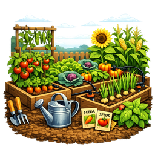

# Garden Planner

  

Turn Home Assistant into a garden planner. Add garden beds and plantings, and get
automatically computed sow / transplant / water / harvest timing based on your
local frost dates — surfaced as sensors, a calendar, and a to-do list.

- Bundled offline plant database (no API key required), with optional Perenual and
  OpenFarm providers.
- Per-planting growth stage, next task, and days-to-harvest sensors.
- Native Calendar and To-do entities for upcoming garden tasks.
- Services and events for automations.

After installing, add the integration from **Settings → Devices & Services**, then
use **Add garden bed** and **Add planting**.
